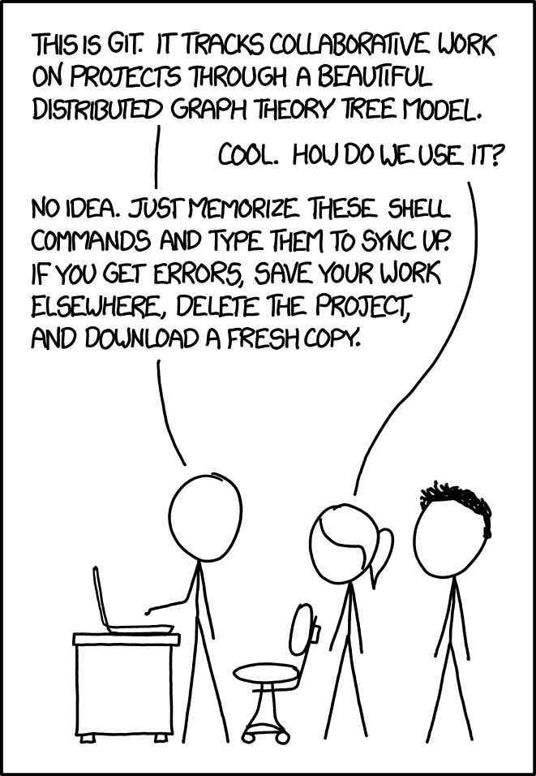

# AI Codebase Assistant

## Authors
Dee Aein

## Project Description
This project is a RAG-powered software engineering tool that helps developers understand GitHub Repositories. 
Devs can provide a link to the public repository. 
The system ingests its source code and documentation. 
Then, it splits the content into searchable chunks. 
Each chunks will be stored with metadata such as line numbers, file paths, and chunk type so the system can provide verifiable answers.
When a user asks a question about the repo, the system will retrieve the top k-relevant chunks and use an LLM to generate an answer grounded in the actual codebase. 
The goal of this project is to demonstrate how AI, semantic search, and backend engineering can be combined to improve developer productivity and repository understanding.

## Project Outline/Plan
1. The user provides a GitHub repository link.
2. The system downloads or reads the repository files.
3. The system filters out unnecessary files, such as generated files, dependency folders, binary files, and other files that are not useful for analysis.
4. Large files are split into smaller code or document chunks.
   - Example: `auth.py` may be split into a login function chunk.
   - Example: `README.md` may be split into ß∂an installation section chunk.
5. Each chunk is stored with metadata that preserves where the chunk came from.
   - Repository name
   - File path
   - Start and end line numbers
   - Function or class name
   - Chunk type, such as code, README, documentation, issue, or pull request
6. Each chunk is sent to an embedding model, such as Sentence Transformers, to convert the text or code into a vector representation.
7. The chunks, metadata, and embeddings are stored in PostgreSQL with pgvector.
8. The user asks a question about the repository.
9. The user's question is converted into an embedding using the same embedding model.
10. The system searches PostgreSQL with pgvector to retrieve the top-k most relevant chunks.
11. The retrieved chunks are organized into context for the LLM.
12. The LLM answers the user's question using only the retrieved repository context.
13. The final answer includes file names and line numbers so the response is verifiable and less likely to hallucinate.

## Interface Plan

The project will use a web-based interface where the user can enter a GitHub repository link and ask questions about that repository. 
The interface will include an input field for the repository URL, a button to start repository ingestion, and a question box for asking about the codebase. 
After the user submits a question, the system will display an AI-generated answer along with file names and line number citations from the retrieved repository chunks. 
The interface should make it clear when the system is ingesting files, searching for relevant chunks, or generating an answer. 

If the system cannot find enough cited context to answer the question, it will tell the user that it does not know instead of guessing.

## Data Collection and Storage Plan

The system will collect repository data from a GitHub repository provided by the user. 
The collected data may include source code files, README files, documentation files, issues, and pull requests. 
Before storing the data, the system will filter out unnecessary files and split large files into smaller chunks. 
Each chunk will be stored with metadata, including the repository name, file path, line numbers, function or class name, and chunk type. 
The chunk text, metadata, and vector embeddings will be stored in PostgreSQL using pgvector so the repository can be searched by semantic meaning.

## Data Analysis and Visualization Plan

The system will analyze repository data by converting code and documentation chunks into embeddings and comparing them with the embedding of the user's question. 
The main analysis method will be semantic similarity search, which finds the top-k chunks most relevant to the user's query. 
The retrieved chunks will be used as context for the LLM so the generated answer is grounded in the actual repository. 
The project may display names of the retrieved files, citation line numbers, similarity scores, and answer sources so users can verify the response. 

This will help show how the system searches the repository, selects relevant context, and reduces hallucination by requiring citations.
