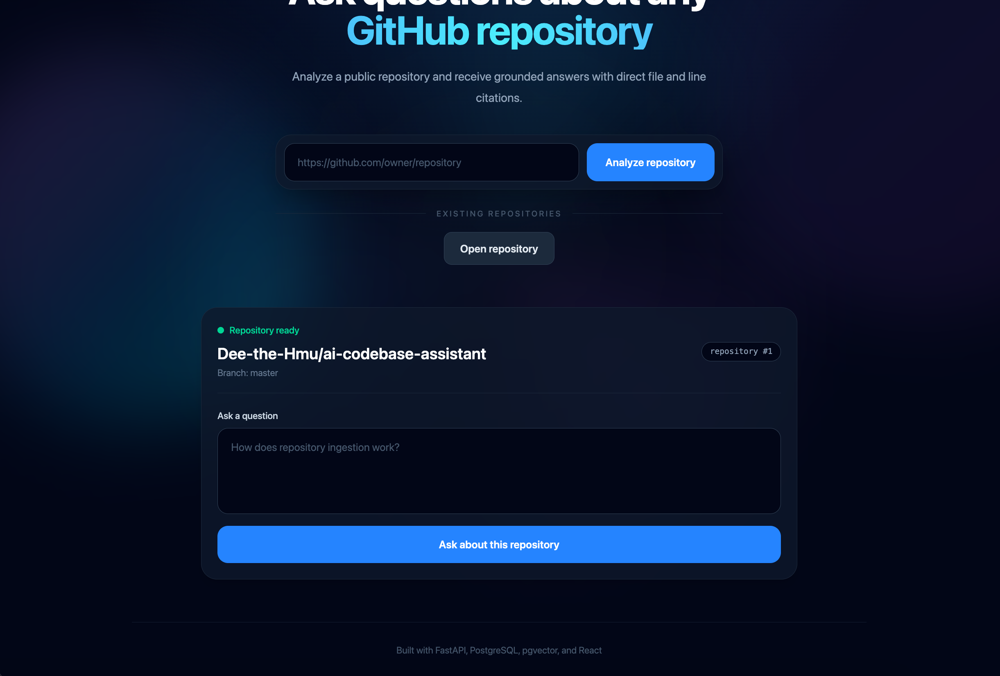
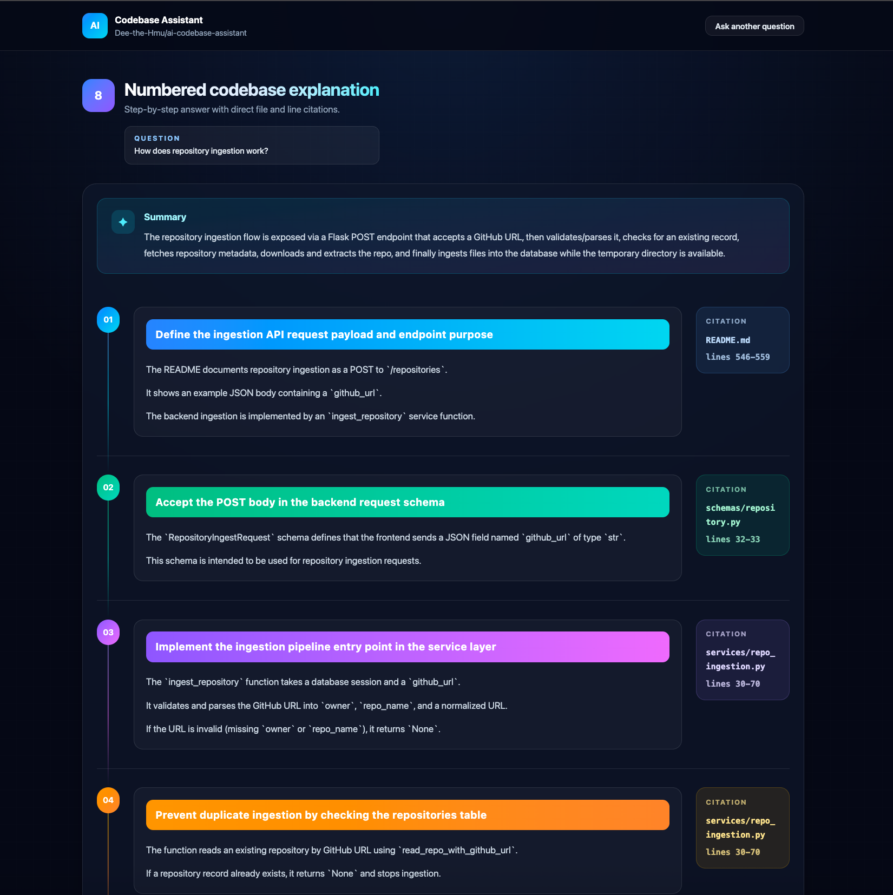
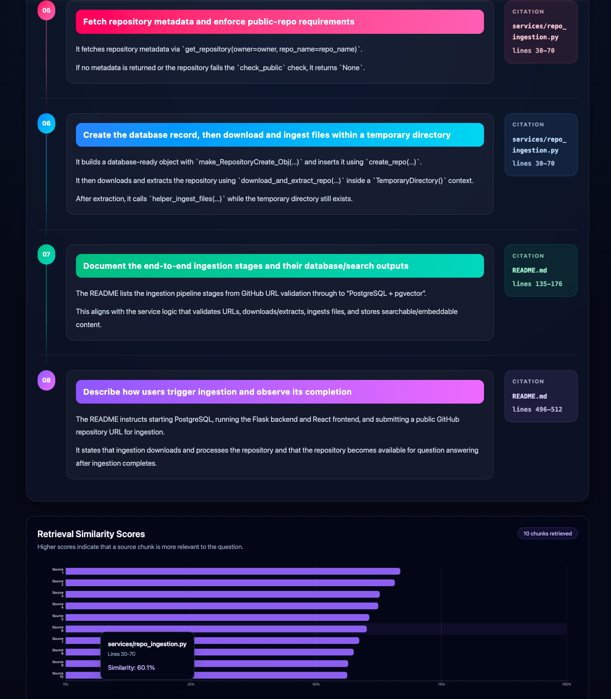

# AI Codebase Assistant

**RAG-powered developer tool that ingests public GitHub repositories and answers codebase questions using semantic retrieval with exact file and line citations.**

Built end-to-end with **Python, Flask, PostgreSQL, pgvector, Sentence Transformers, OpenAI, React, Docker, and AWS**.

---

## Impact

- **Achieved 100% Top-10 and 86.7% Top-2 retrieval success** across 15 repository-specific questions on 2 codebases using Sentence Transformer embeddings and pgvector cosine-similarity search.
- **Achieved 100% grounded responses** across 15 manually evaluated answers by constraining OpenAI-generated responses to retrieved code context and returning exact file- and line-level citations through REST API endpoints.

---

## Live Demo

> **Live Application:** https://d12mwdjp9rnq6y.cloudfront.net/
> > **Note:** The live deployment may be temporarily unavailable due to AWS hosting costs. Screenshots and architecture details below show the deployed application and system design.





---

## Architecture

```text
                               ┌─────────────────────┐
                               │     GitHub Repo     │
                               └──────────┬──────────┘
                                          │
                                          │ Download
                                          ▼
                               ┌─────────────────────┐
                               │   ECS / Fargate     │
                               │   Flask REST API    │
                               └──────────┬──────────┘
                                          │
                         ┌────────────────┴────────────────┐
                         │                                 │
                         │ Repository Ingestion            │ Question Answering
                         ▼                                 ▼
              ┌─────────────────────┐           ┌─────────────────────┐
              │ Download / Filter   │           │ Sentence            │
              │ Chunk Source Files  │           │ Transformers        │
              └──────────┬──────────┘           │ Question Embedding  │
                         │                      └──────────┬──────────┘
                         ▼                                 │
              ┌─────────────────────┐                      ▼
              │ Sentence            │           ┌─────────────────────┐
              │ Transformers        │           │ PostgreSQL          │
              │ Chunk Embeddings    │           │ + pgvector          │
              └──────────┬──────────┘           │ Semantic Search     │
                         │                      └──────────┬──────────┘
                         ▼                                 │
              ┌─────────────────────┐                      │ Retrieved
              │ PostgreSQL          │                      │ Code Chunks
              │ + pgvector          │                      ▼
              │ Files / Chunks /    │           ┌─────────────────────┐
              │ Embeddings          │           │ OpenAI LLM          │
              └─────────────────────┘           │ Grounded Answer     │
                                                │ + Citations         │
                                                └──────────┬──────────┘
                                                           │
                                                           ▼
                                                ┌─────────────────────┐
                                                │   ECS / Fargate     │
                                                │   Flask REST API    │
                                                └──────────┬──────────┘
                                                           │
                                                           ▼
┌─────────┐    ┌─────────────────┐    ┌─────────────────┐    ┌─────────────────┐
│  User   │───▶│ Frontend        │───▶│ Backend         │───▶│      ALB        │
└─────────┘    │ CloudFront      │    │ CloudFront      │    └────────┬────────┘
               │       │         │    │ HTTPS API       │             │
               │       ▼         │    └─────────────────┘             ▼
               │      S3         │                          ┌─────────────────┐
               │ React / Vite    │                          │ ECS / Fargate   │
               └─────────────────┘                          │ Flask REST API  │
                                                            └─────────────────┘
```

### AWS Deployment

```text
Frontend:
User → CloudFront → S3

Backend:
CloudFront → Application Load Balancer → ECS/Fargate → RDS PostgreSQL

Container Deployment:
Docker Image → ECR → ECS Task Definition → Fargate Task
```

---

## Key Engineering Features

- **End-to-end RAG pipeline** for understanding unfamiliar codebases
- **Semantic retrieval with PostgreSQL + pgvector** using cosine distance
- **Repository-aware search** that restricts retrieval to the selected repository
- **Exact file and line citations** preserved from retrieved source chunks
- **Grounded LLM generation** restricted to retrieved repository context
- **GitHub ingestion pipeline** for downloading, filtering, reading, and processing source code
- **Metadata-aware chunking** preserving file paths, line ranges, functions, classes, and chunk types
- **Sentence Transformer embeddings** for source code and user questions
- **REST API** for repository ingestion, repository discovery, and question answering
- **Framework-independent service layer** shared by Flask and FastAPI implementations
- **Dockerized backend deployed with AWS ECS/Fargate**
- **PostgreSQL + pgvector deployed with Amazon RDS**
- **Production frontend hosted through S3 + CloudFront**
- **Application Load Balancer** routing requests to healthy ECS tasks

---

## How It Works

1. **Ingest Repository**  
   A user submits the URL of a public GitHub repository. The backend validates the repository and retrieves its latest commit.

2. **Process Source Code**  
   The repository is downloaded as a ZIP archive, extracted temporarily, and recursively scanned. Unsupported, generated, secret, oversized, and dependency files are filtered out.

3. **Chunk and Embed**  
   Supported files are divided into searchable chunks while preserving metadata such as file path, line range, function name, class name, and chunk type. Each chunk is converted into a vector embedding.

4. **Store in PostgreSQL**  
   Repository metadata, file metadata, chunks, and embeddings are stored in PostgreSQL with pgvector.

5. **Retrieve Relevant Code**  
   A user question is embedded using the same embedding model. pgvector performs repository-specific cosine similarity search and retrieves the most relevant source chunks.

6. **Build Grounded Context**  
   Retrieved chunks are formatted into structured source context containing the exact source path, line range, metadata, and code.

7. **Generate the Answer**  
   The LLM receives only the retrieved repository context and the user's question, then returns a structured explanation with exact file and line citations.

---

## RAG Pipeline

```text
User Question
      │
      ▼
Question Embedding
      │
      ▼
Repository-Filtered pgvector Search
      │
      ▼
Top Relevant Code Chunks
      │
      ▼
Structured Source Context
      │
      ▼
OpenAI LLM
      │
      ▼
Grounded Answer
      │
      ▼
Exact File + Line Citations
```

---

## Engineering Decisions & Challenges

### Preventing Hallucinated Citations

An early version allowed the LLM to generate narrower line ranges than those actually returned by retrieval.

The grounding prompt was strengthened so the model must use the **complete file path and exact stored line range** from a retrieved source chunk.

Generated citations follow:

```text
[file_path:start_line-end_line]
```

Example:

```text
[services/repo_ingestion.py:30-70]
```

Structured citation data is also generated directly from retrieved database chunks rather than relying entirely on model-generated citation text.

---

### Repository-Aware Semantic Retrieval

All vector searches are filtered by repository ID before results are returned.

This prevents semantically similar chunks from unrelated repositories from entering the LLM context.

```text
Question Embedding
        │
        ▼
Filter by Repository
        │
        ▼
Cosine Similarity Search
        │
        ▼
Relevant Code Chunks
```

---

### Preserving Source Context During Chunking

Chunks contain more than raw code.

Each chunk can preserve:

- File path
- Start line
- End line
- Function name
- Class name
- Chunk type
- Source code context

This metadata allows retrieved results to remain traceable back to the original repository.

---

### Separating Framework Logic from Core Services

The project supports both **Flask and FastAPI** API layers while sharing the same underlying:

- Database models
- CRUD operations
- Schemas
- Repository ingestion
- File processing
- Chunking
- Embedding
- Semantic retrieval
- LLM answer generation

This keeps HTTP framework concerns separate from the core application logic.

---

### Deploying the Backend as a Containerized AWS Service

The backend is packaged as a Docker image and stored in **Amazon ECR**.

ECS/Fargate runs the container using an ECS task definition, while an Application Load Balancer provides a stable network entry point and routes requests to healthy tasks.

```text
Backend Code
     │
     ▼
Docker Image
     │
     ▼
Amazon ECR
     │
     ▼
ECS Task Definition
     │
     ▼
ECS / Fargate Task
     │
     ▼
Application Load Balancer
```

Amazon RDS provides the PostgreSQL + pgvector database, while AWS networking and security groups restrict communication between infrastructure components.

---

## Tech Stack

| Area | Technologies |
|---|---|
| **Backend** | Python, Flask, FastAPI (alternative API layer), SQLAlchemy, Pydantic |
| **RAG / AI** | Sentence Transformers, OpenAI Responses API, vector embeddings |
| **Database** | PostgreSQL, pgvector, Alembic |
| **Frontend** | React, TypeScript, Vite, Tailwind CSS, React Router |
| **Visualization** | Matplotlib |
| **Containers** | Docker |
| **AWS** | ECR, ECS/Fargate, RDS, S3, CloudFront, Application Load Balancer |
| **External API** | GitHub REST API |

---

## Results & Evaluation

The retrieval and grounding pipeline was evaluated using both the project's own codebase and the public [Requests](https://github.com/psf/requests) repository.

### Retrieval Quality

#### AI Codebase Assistant — 10 Question Evaluation

| Metric | Result |
|---|---:|
| Correct source in Top 10 | **100% (10/10)** |
| Correct source in Top 2 | **90% (9/10)** |
| Correct source ranked #1 | **60% (6/10)** |
| Average ground-truth rank | **1.9** |
| Average similarity | **54.3%** |
| Fully grounded answers | **100%** |

The correct source appeared within the top 10 retrieved chunks for every test question, and within the top two results for 9 of 10 questions.

This evaluation also exposed an early citation-grounding issue: although answers were grounded in the retrieved code, the LLM sometimes shortened retrieved line ranges when generating citations. The grounding prompt was subsequently strengthened to require the exact stored chunk range.

---

#### Requests — External Repository Evaluation

Repository: `psf/requests`

| Metric | Result |
|---|---:|
| Correct source in Top 10 | **100% (5/5)** |
| Correct source in Top 2 | **80% (4/5)** |
| Fully grounded answers | **100% (5/5)** |
| Valid exact citations | **100% (5/5)** |
| Average response latency | **4.7 s** |

The questions covered multi-step behaviors including HTTP request preparation, adapter selection, urllib3 transport, `PreparedRequest` construction, and redirect handling.

Testing on an external repository helped verify that the retrieval pipeline generalized beyond the codebase it was developed on.

---

### Repository Ingestion

| Repository | Files Discovered | Files Processed | Chunks Created | Ingestion Time |
|---|---:|---:|---:|---:|
| AI Codebase Assistant | 75 | 55 | 158 | ~27 s |
| Requests | 130 | 65 | 771 | 155 s |

For the Requests repository, the system:

```text
130 files discovered
        ↓
65 files processed
        ↓
771 searchable chunks
        ↓
771 embeddings generated
        ↓
PostgreSQL + pgvector
```

These tests demonstrate the complete pipeline across repositories of different sizes, from source-file discovery and filtering through chunking, embedding, semantic retrieval, grounded generation, and citation validation.

---

## Current Limitations

- Supports public GitHub repositories only
- Repository ingestion is currently synchronous
- Large repositories require additional processing time and memory
- Repository updates are not automatically re-ingested
- Retrieval currently uses a fixed top-k value
- Chunking is currently strongest for Python source files
- Automated testing and broader evaluation are still in progress

---

Instead of allowing an LLM to answer questions from general model knowledge, the system retrieves relevant source code from the actual repository and uses that code as the grounded context for every answer.
